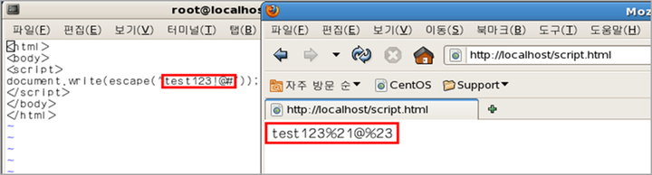
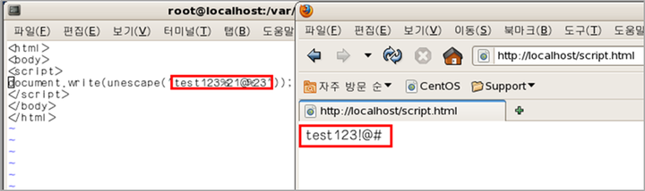

#2.인코딩/디코딩함수 

-인코딩 : 문자를 컴퓨터에 저장 또는 통신에 사용하 목적으로 부호화 하는 방법 
-디코딩 : 부호화 된 문자를 원래대로 되돌리는 것 
 
|#함수이름 |#설명|
| :------------ | :------------|
|escape()|영문 알파벳과 숫자, 일부 특수문자(@,*,-,_,+,.,/)를 제외한 문자만 인코딩|
|unescape()|영문 알파벳과 숫자, 일부 특수문자(@,*,-,_,+,.,/)를 제외한 문자만 디코딩|
|encodeURI(url) |인터넷 주소에 사용되는 일부 특수문자():,;,/,=,?,&)을 제외한 문자만 인코딩|
|decodeURI(encodedURI) |인터넷 주소에 사용되는 일부 특수문자():,;,/,=,?,&)을 제외한 문자만 디코딩|
|encodeURIComponent(urlComponent) |알파벳과 숫자를 제외한 모든 문자를 모두 인코딩|
|decodeURIComponent(encodedURI) |알파벳과 숫자를 제외한 모든 문자를 모두 디코딩|

####escape()와 unescape()의 예제 

Javascript에서 escape는 하나의 함수로 이 함수를 사용해 인코딩하면 알파벳과 숫자 *@-_+./을 제외한 나머지
특수문자만 ASCII 값으로 변환하여 주는데 여기서 표현 방식은 ASCII 값 앞에 %기호를 사용하여 표현합니다. 
디코딩 방식은 unescape 함수를 사용하면 다시 원래의 특수문자로 표현을 해 줍니다.<br>

[Javascript escape 인코딩 예제]

<br>

위 이미지 에서 영문자인 test와 숫자인 123 그리고 변환하지 않는 @를 제외한 나머지 특수문자 느낌표(!)와 #이 ASCII 값으로 전환되어 %21@%23으로 출력 된 것을 확인할 수 있습니다. 


[Javascript unescape 디코딩 예제]

<br>

위에서 변환한 값을 unescape로 디코딩한 결과로
ASCII 값으로 출력되었던 값들이 다시 원래의 특수문자로 표현되는 것을 알 수 있습니다.


#3.코드 실행 함수 
-문자열을 코드로 실행 할 수 있는 특별한 함수.<br>
-eval()함수로 실행 된 코드에서 정의한 변수도 활용 가능

|함수이름 |설명|
| :------------ | :------------|
|eval()|string을 자바스크립트 코드로 실행|

```javascript
<!-- eval.html -->
<!DOCTYPE html>
<html>
<head>
<meta charset="UTF-8">
<title>eval</title>
<script type="text/javascript">
   var evalString = '';
   evalString += 'var num = 10;';
   evalString += 'alert(num);';
   
   eval(evalString); // eval() 함수 호출
   
   eval(num); // eval() 함수로 호출한 코드의 변수를 사용
</script>
</head>
<body>
</body>
</html>
```
위의 예제를 실행하면 10이 호출 됩니다.

[참고- http://gangzzang.tistory.com/140]
[참고- http://blog.naver.com/rewrite46/90189895760]
