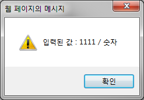
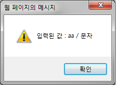
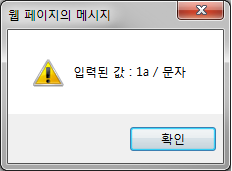

#숫자 확인 함수
```
자바스크립트에는 Infinity와 NaN이라는 특별한 숫자가 있습니다.
변수에 있는 이런 특별한 형태의 숫자를 확인할 경우에는 반드시 아래의 함수를 사용해야 합니다.
```
isFinite() 숫자가 무한한 값인지 확인

isNaN() 숫자가 NaN(숫자아님)인지 확인

isFinite() 예시

```javascript
<script>
	<html>
<head>
	<script type="text/javascript">
		var numberCheck = function() {
			var temp = document.getElementById('input').value;
			if(isNaN(temp) == true) {
				alert("입력된 값 : " + temp + " / 문자");
			} else {
				alert("입력된 값 : " + temp + " / 숫자");
			}
		};
	</script>
</head>
<body>
	<input type="text" id="input" />
	<input type="button" value="확인" onClick="numberCheck()" />
</body>
</html>
</script>
```
isNaN("문자") ==> true
isNaN(숫자) ==> false 

<br>
<br>
<br>
<br>
<br>
<br>


###isFinite()
```
필수 number 인수는 임의의 숫자 값입니다.

isFinite 함수는 number가 NaN, 음의 무한대 또는 양의 무한대 이외의 값이면 true를 반환하고,
이 세 경우에는 false를 반환합니다.
```

