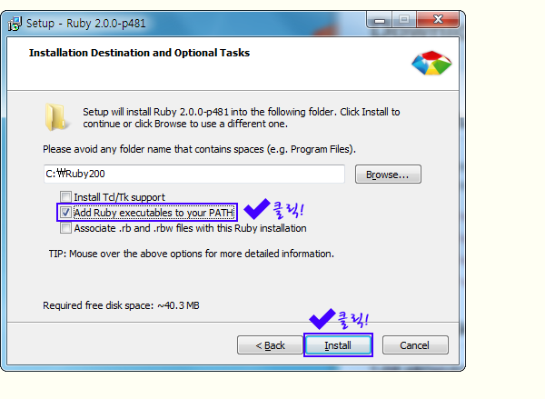
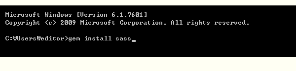
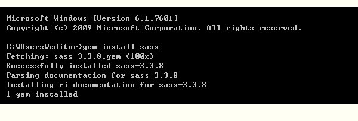

# sass 시작

sass 는 `sass` 와 `scss` 두개가 있습니다.
일반적으로 둘다 사스(sass) 라고 부릅니다.

이둘은 약간의 차이점이 있습니다.
가장 큰차이점은 문법에서 세미콜론 `;` 과 중괄호 `{}` 가 있고 없고의 차이입니다.

예:

```scss
// scss
body {
	color: #333;
	background: #fff;
}
.header {
	color: #333;
	background: #fff;
}
```

```sass
// sass
body
	color: #333
	background: #fff
.header
	color: #333
	background: #fff
```


## sass 환경설정

[Ruby](https://www.ruby-lang.org/ko/), [Node.js](https://nodejs.org/)


## sass 설치

### sass for Windows


[루비다운로드](http://rubyinstaller.org/downloads/)

루비를 기반으로 돌아가는 sass 이며 windows 환경에서 ruby를 설치해줘야합니다.



설치 중간에 나오는 환경변수 자동등록을 체크해주세요.

그후 명령프롬프트창에서

gem install sass 

라고 입력해주면 자동으로 설치가 됩니다.






설치완료!


### sass for mac

맥에서는 루비가 기본 내장되어있기 때문에 따로 루비를 설치하실 필요가 없습니다.

터미널을 실행후

gem install sass 

라고 입력해주면 자동으로 설치가 됩니다.


## sass 명령어


```sh
$ sass -h # 도움말 보기
$ sass style.scss(작성된파일):style.css(컴파일될파일) # 해당 명령어를 입력하면 앞의 파일을 뒤의 파일로 컴파일을 실행함
$ sass --watch style.scss:style.css # 앞의 파일이 변경되면 감지하여 자동으로 뒤의 파일명으로 컴파일 해줌
$ sass --style 스타일종류 style.scss:style.css # 컴파일되는 css의 포맷형식을 지정해줌
$ sass -w -t compact style.scss:style.css # -w 는 --watch 의 약어이고 -t는 --style 의 약어임
```

#### style의 종류

중첩(nested) : sass의 기본스타일로 html문서처럼 부모요소에 대한 하위요소는 들여쓰기 되는 형식.

```css
ul {
  font-family: Georgia;
  color: #333333; }
  ul li {
    display: inline-block; }
```


확장(expanded) : 일반적인 css 스타일로 선택자에 따라 속성이 들여쓰기 되는 형식. 계층 구조라 하더라도 선택자 앞에, 즉 ul li 앞에 공백이 없습니다.


```css
ul {
  font-family: Georgia;
  color: #333333;
}
ul li {
  display: inline-block;
}
```


축약(compact) : 우리나라 업무에서 가장 많이 사용되는 스타일로 한줄씩 출력되는 스타일. 선언이 여러 개 있어도 줄바꿈을 하지 않습니다.


```css
ul { font-family: Georgia; color: #333333; }
ul li { display: inline-block; }
```


압축(compress) : 소스 압축 형태의 스타일


```css
ul{font-family:Georgia;color:#333333}ul li{display:inline-block}
```


## Windows 환경에서 한글(CP949) 오류 발생 시, 언어 인코딩 UTF-8로 설정

```sh
$ sass -E utf-8 sass/style.scss css/style.css # 인코딩 옵션 설정 -E utf-8
```


