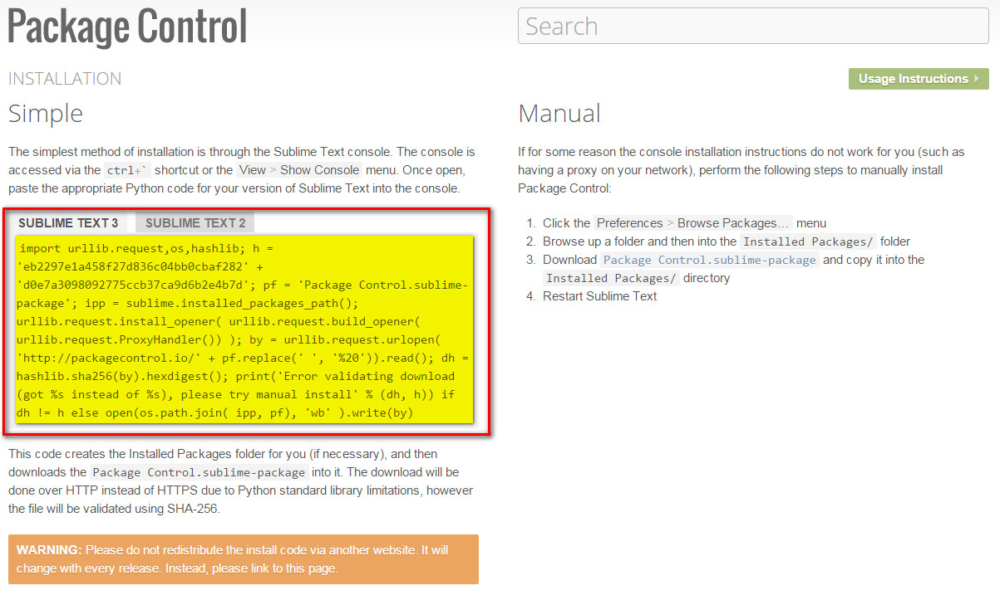
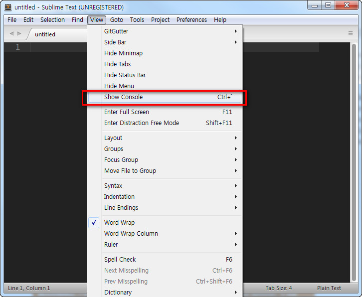
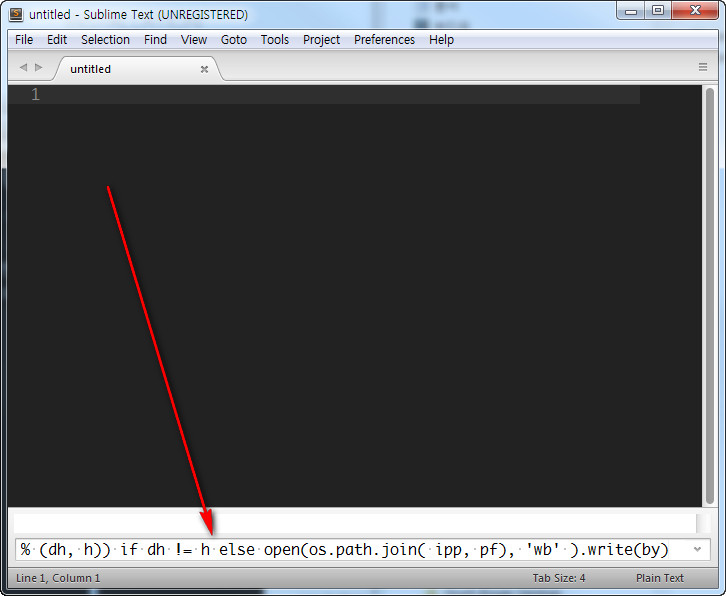

# 01-프로그램-설치


Sublimetext 는 현재 3버젼이 나왔으므로 3버젼에 촛점을 맞춤니다.

[Sublimetext3 다운로드](http://www.sublimetext.com/3)


해당버젼에 맞게 설치하면 됩니다.


# Packages Control

서브라임텍스트를 설치한후 가장먼저해야할것이 `Packages Control` 을 설치하는것입니다.

플러그인을 설치하려면 가장먼저 설치가 되어 있어야 합니다.

버젼이 3임으로 [https://packagecontrol.io/installation](https://packagecontrol.io/installation) 에서 `Packages Control` 를 복사해서 설치하면 된다.
노랑색부분에 해당하는 코드를 복사하세요.



`Sublimetext3 Packages Control` 의 코드는 이렇습니다.

```sh
import urllib.request,os,hashlib; h = 'eb2297e1a458f27d836c04bb0cbaf282' + 'd0e7a3098092775ccb37ca9d6b2e4b7d'; pf = 'Package Control.sublime-package'; ipp = sublime.installed_packages_path(); urllib.request.install_opener( urllib.request.build_opener( urllib.request.ProxyHandler()) ); by = urllib.request.urlopen( 'http://packagecontrol.io/' + pf.replace(' ', '%20')).read(); dh = hashlib.sha256(by).hexdigest(); print('Error validating download (got %s instead of %s), please try manual install' % (dh, h)) if dh != h else open(os.path.join( ipp, pf), 'wb' ).write(by)
```

서브라임텍스트에서 `Ctrl+`` 를 누르던가 아니면 `View - Show Console` 를 클릭하면 콘솔창이 열립니다.



아래 화살표처럼 콘솔창에 코드를 붙여넣고 엔터를 치면 설치가 끝난다.



----


----