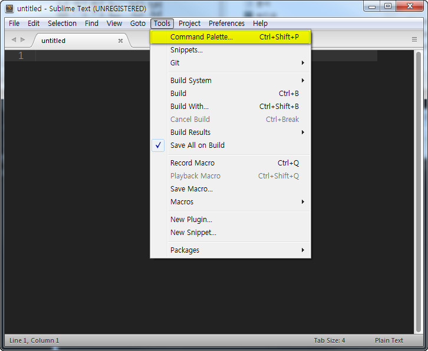
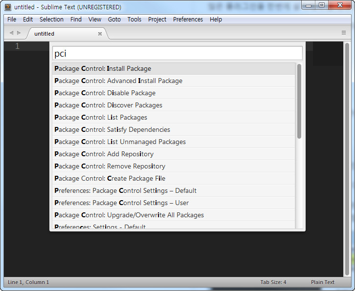
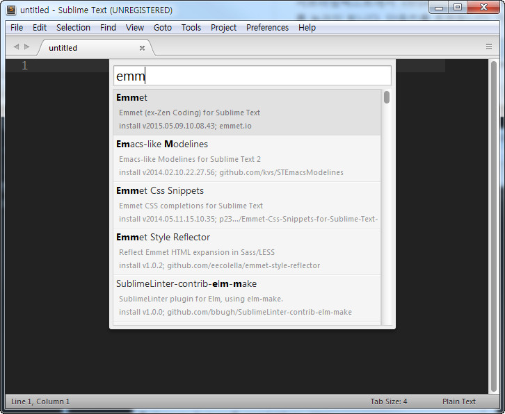
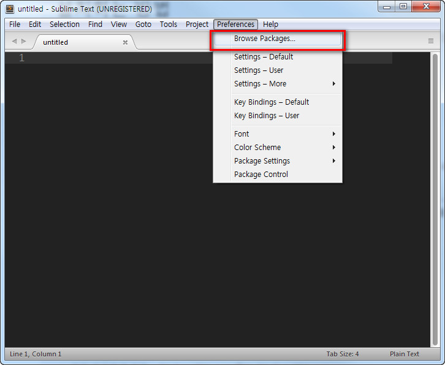
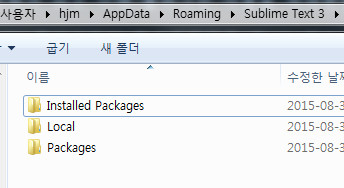
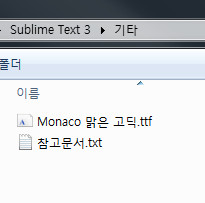
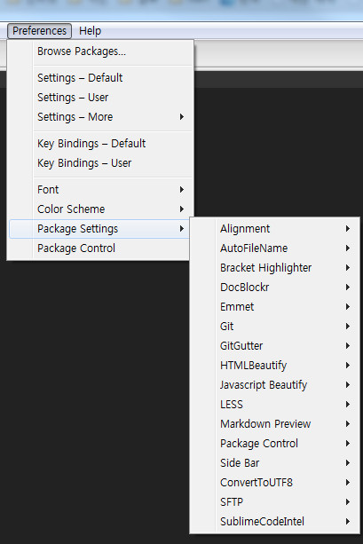

# 02-플러그인-설치

플러그인은 일반적으로 한번에 하나씩 설치를 합니다.

많은 플러그인을 한번에 설치해야 할 경우도 있습니다.

여기서는 일반적으로 한번에 하나씩 설치하는 경우와 한번에 모든걸 설치하는 경우를 알려드립니다.

emmet 플러그인을 예제로 합니다.

## emmet-플러그인-설치

`emmet` 플러그인은 젠코딩을 사용한다든가하는 많은 기능을 지원하는 플러그인 입니다. 아마도 가장 인기있는 플로그인일겁니다.

꼭 사용해야하는 필수 플러그인입니다.

자세한 사용법은 [emmet 홈페이지](http://emmet.io/)에서 확인하시기 바랍니다.

플러그인을 설치하는 방법은 똑같습니다. 다른 플러그인도 이렇게 설치합니다.

서브라임텍스트에서 `Ctrl+Shift+p` 를 눌러 명령창을 엽니다. 혹은 `Tool - Command Palette` 를 눌러되 됩니다.
단축키를 추천합니다. 가장 많이 사용하는 단축키일겁니다.

명령창에서 `Install Package` 를 쳐야하지만 단축키도 지원하니 저처럼 `pci` 를 치는것을 권장합니다.

클릭을 하면 다시 명령창이 활성화가 되고 이때 플러그인 이름을 적어주면 됩니다. 여기서는 `emmet` 를 적어보겠습니다.

`emm` 까지 입력해도 아래 `Emmet` 플러그인이 활성화된것을 볼 수 있습니다. 현재상태에서 엔터를 칩니다.

플러그인 설치가 완료가 되었습니다.    
플러그인의 README 가 있으면 관련글이 아래처럼 처음에 보이기도 합니다.

## 플러그인-한번에-설치

플러그인을 한번에 설치하는 것은 관련 폴더와 파일을 복사해서 붙여넣는 것입니다.

인터넷이 않될때, 프로그램을 설치한 후 플러그인이 많아서 설치가 번거로울때 사용하면 좋습니다.    
또한 플러그인뿐만 아니라 [01-프로그램-설치](01-프로그램-설치.md) 에서 말한 `Packages Control` 도 설치되고 [03-환경설정](docs/03-환경설정.md)도 한번에 적용이 됩니다.

첨부한 파일은 윈도우 64비트 입니다.

설정까지 모두 되어있고, 테마까지 모두 적용이 되어 있습니다.

서브라임텍스트를 실행해서 `Preferences - Browse Packages` 를 클릭합니다.

한단게 위로 올라가서 `Sublime Text 3` 폴더를 보면 아래처럼 보입니다.

첨부한 파일의 압축을 풀면 동일한 형태로 되어 있씁니다.

[Sublime Text 3 플러그인 파일 다운로드](../Sublime%20Text%203.zip)

기타폴더에는 제가 사용하는 폰트가 있으니 `제어판-모든 제어판 항목-글꼴` 에 넣으면 설치가 됩니다.

제가 사용하던 플러그인 목록입니다.

