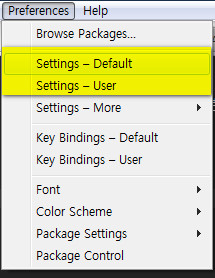

# 03-환경설정

서브라임텍스트는 기본환경설정이 있고, 유저환경설정 두개를 제공하고 있습니다.



환경설정을 수정하고 싶으면 기본환경설정은 두고 유저환경설정을 변경하면 됩니다. 유저환경설정이 더 우선합니다.

환경설정을 되돌리고 싶으면 유저환경설정에서 원하는 항목만 삭제하면 기본환경설정으로 적용됩니다.

[플러그인-한번에-설치](docs/02-플러그인-설치.md#플러그인-한번에-설치)를 한경우 설정도 한번에 적용됩니다.


<br><br>


## 환경설정

자주 사용하는 환경설정은 아래와 같습니다.

| 옵션 | 선택값 | 설명 |
|------|--------|------|
| alignment_chars | ["=",":"] | Alignment 플러그인을 설치후 해당기호를 대상으로 정렬합니다 |
| bold_folder_labels | true | 폴더를 강조표시합니다 |
| draw_white_space | all | 빈칸을 표시합니다 |
| fade_fold_buttons | false |
| folder_exclude_patterns | [".svn", ".hg", "CVS"] | 해당파일을 제외시킵니다. |
| font_face | Monaco | Monaco 글꼴을 사용합니다. |
| font_size | 11 | 글꼴크기를 설정합니다. |
| highlight_line | true | 현재라인을 강조표시합니다 |
| highlight_modified_tabs | true | 수정된 탭을 강조표시합니다 |
| ignored_packages | ["Jade", "Vintage", "Handlebars", "Markdown", "SublimeLinter", "HTML-CSS-JS Prettify"] | 해당파일을 제외시킵니다. |
| indent_guide_options | ["draw_normal", "draw_active"] | 들여쓰기 가이드를 표시합니다. |
| save_on_focus_lost | true | 포커스가 떠나면 자동으로 저장합니다.
| always_show_minimap_viewport | true | 미니맵에서 현재 위치 보여줍니다.
| draw_minimap_border | true | 미니맵에 테두리를 표시합니다.
| showProjectPanel | true | 프로젝트 판넬을 표시합니다.
| color_scheme | Packages/User/colour-schemes/Monokai Soda.tmTheme | Soda 테마의 Monokai 글꼴색을 사용합니다. |
| soda_classic_tabs | true | Soda 테마의 곡선 탭을 사용합니다. |
| soda_folder_icons | true | Soda 테마의 폴더아이콘을 사용합니다. |
| theme | Soda Light 3.sublime-theme | Soda Light 테마를 사용합니다.
| update_check | false | 서브라임텍스트의 라이센스 업데이트를 중지합니다.

원문은 아래와 같습니다.

```
{
	"alignment_chars":
	[
		"=",
		":"
	],
	"always_show_minimap_viewport": true,	// 언제나 미니맵을 사용합니다.
	"draw_minimap_border": true, 			// 미니맵에 보더를 사용합니다.
	"fade_fold_buttons": false,				// 탭닫기버튼에 오버기능이 포함된 버튼이 표시됩니다.
	"folder_exclude_patterns":
	[
		".svn",
		".hg",
		"CVS"
	],
	"font_face": "Monaco",
	"font_size": 11,
	"highlight_line": true,
	"highlight_modified_tabs": true,
	"ignored_packages":
	[
		"Handlebars",
		"HTML-CSS-JS Prettify",
		"Jade",
		"Markdown",
		"SublimeLinter",
		"Vintage"
	],
	"indent_guide_options":
	[
		"draw_normal",
		"draw_active"
	],
	"save_on_focus_lost": true,				// 포커스가 떠나면 저장합니다.
	"showProjectPanel": true,
	"update_check": false
}
```


<br><br>


## 테마-설정

서브라임텍스트는 많은 테마를 적용할 수 있습니다.

[https://packagecontrol.io/browse/labels/theme](https://packagecontrol.io/browse/labels/theme) 에서 테마의 목록을 볼 수 있습니다.

[http://colorsublime.com/](http://colorsublime.com/) 에서 테마를 미리 볼 수 있습니다.


테마설치는 [emmet-플러그인-설치](docs/02-플러그인-설치.md#emmet-플러그인-설치) 에서 하듯이 테마의 이름을 입력해서 설치하면 되고, 테마의 자세한 설정은 해당 테마의 홈페이지에서 볼 수 있습니다.

아래는 [Soda 테마](http://buymeasoda.github.io/soda-theme/) 의 홈페이지 입니다.


----

* [Sublimetext 목록으로 돌아가기](../README.md)
* [01-프로그램-설치](01-프로그램-설치.md)
* [02-플러그인-설치](02-플러그인-설치.md)
* [03-환경설정](03-환경설정.md)
* [04-사용팁](04-사용팁.md)
* [101_Markdown-Basics](101_Markdown-Basics.md)
* [102_GitHub-Flavored-Markdown](102_Github-Flavored-Markdown.md)
* [103_Writing-on-Github](103_Writing-on-Github.md)
* [104_Mastering-Markdown](104_Mastering-Markdown.md)

----
