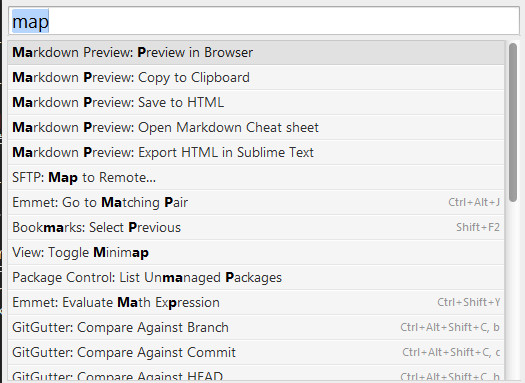
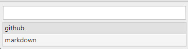
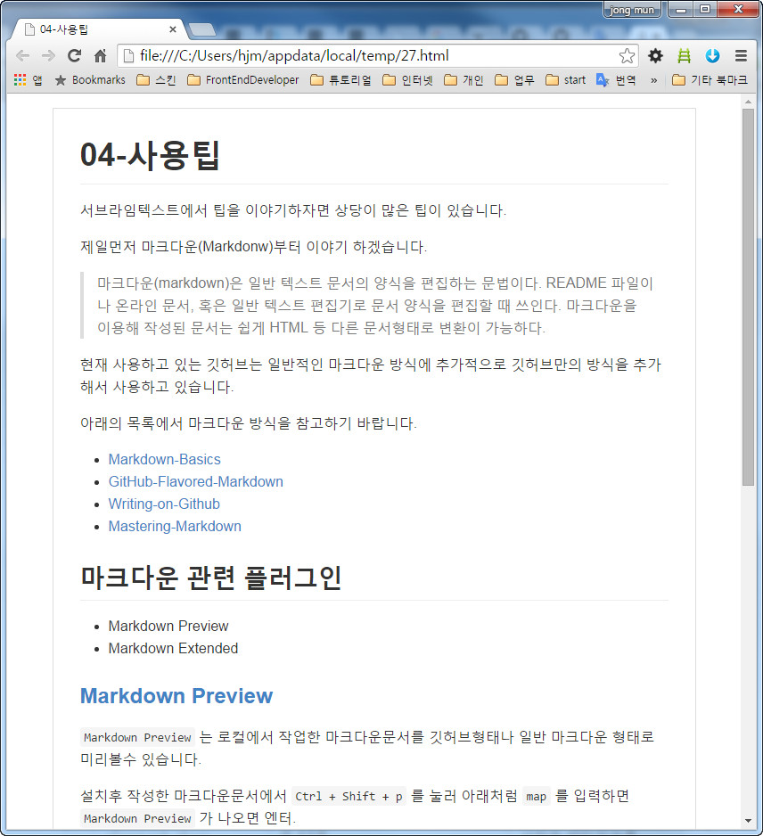

# 04-사용팁

서브라임텍스트에서 팁을 이야기하자면 상당이 많은 팁이 있습니다.

제일먼저 마크다운(Markdonw)부터 이야기 하겠습니다.

> 마크다운(markdown)은 일반 텍스트 문서의 양식을 편집하는 문법이다. README 파일이나 온라인 문서, 혹은 일반 텍스트 편집기로 문서 양식을 편집할 때 쓰인다. 마크다운을 이용해 작성된 문서는 쉽게 HTML 등 다른 문서형태로 변환이 가능하다.

현재 사용하고 있는 깃허브는 일반적인 마크다운 방식에 추가적으로 깃허브만의 방식을 추가해서 사용하고 있습니다.

아래의 목록에서 마크다운 방식을 참고하기 바랍니다.

- [Markdown-Basics](101_Markdown-Basics.md)
- [GitHub-Flavored-Markdown](102_Github-Flavored-Markdown.md)
- [Writing-on-Github](103_Writing-on-Github.md)
- [Mastering-Markdown](104_Mastering-Markdown.md)

## 마크다운 관련 플러그인

* Markdown Preview
* Markdown Extended

### [Markdown Preview](https://packagecontrol.io/packages/Markdown%20Preview)
`Markdown Preview` 는 로컬에서 작업한 마크다운문서를 깃허브형태나 일반 마크다운 형태로 미리볼수 있습니다.

설치후 작성한 마크다운문서에서 `Ctrl + Shift + p` 를 눌러 아래처럼 `map` 를 입력하면 `Markdown Preview` 가 나오면 엔터.

그럼 새창이 열리고 `github` 스타일로 열건지, 일반 `markdown` 스타일로 열건지 물어봅니다. 여기서 그냥 엔터를 지면 현재문서를 `github` 스타일로 엽니다.

현재 문서를 한번 보았습니다.

## 사용방법

* [emmet](http://emmet.io/)
* 한글설정
	* 한글지원 글꼴 설정
	* EUC-KR 문서- [Convert​To​UTF8](https://packagecontrol.io/packages/ConvertToUTF8) 플러그인 설치
	* 한글 입력- [IMEsupport](https://packagecontrol.io/packages/IMESupport) 플러그인 설치
	* 한글 메뉴 사용 - [sublimetext_korean](https://github.com/H5Lab/sublimetext_korean)

----

* [Sublimetext 목록으로 돌아가기](../README.md)
* [01-프로그램-설치](01-프로그램-설치.md)
* [02-플러그인-설치](02-플러그인-설치.md)
* [03-환경설정](03-환경설정.md)
* [04-사용팁](04-사용팁.md)
* [101_Markdown-Basics](101_Markdown-Basics.md)
* [102_GitHub-Flavored-Markdown](102_Github-Flavored-Markdown.md)
* [103_Writing-on-Github](103_Writing-on-Github.md)
* [104_Mastering-Markdown](104_Mastering-Markdown.md)

----