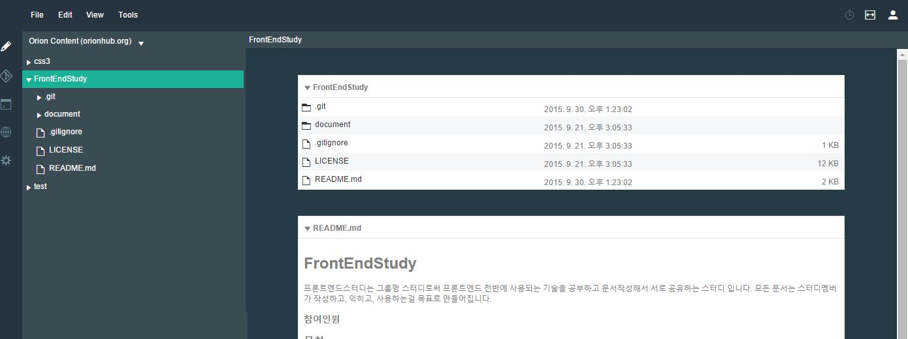
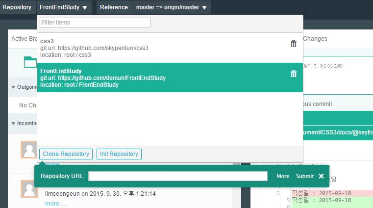
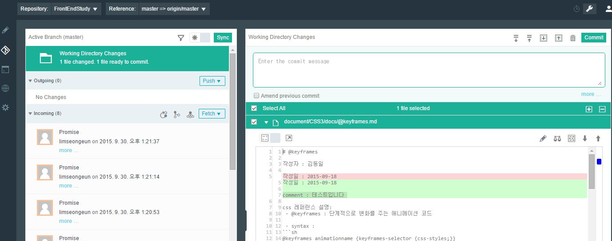
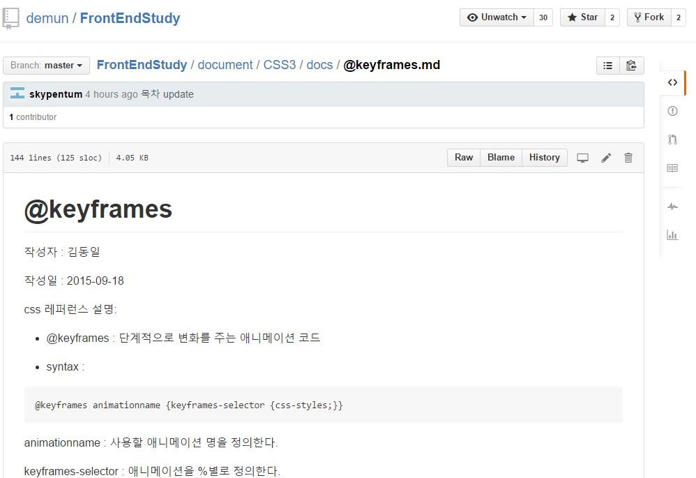
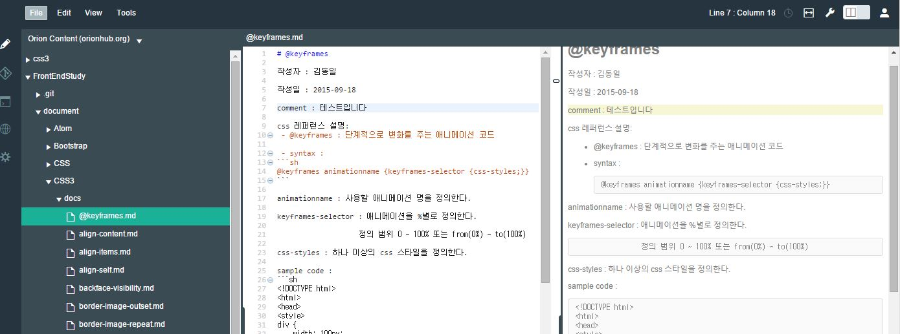
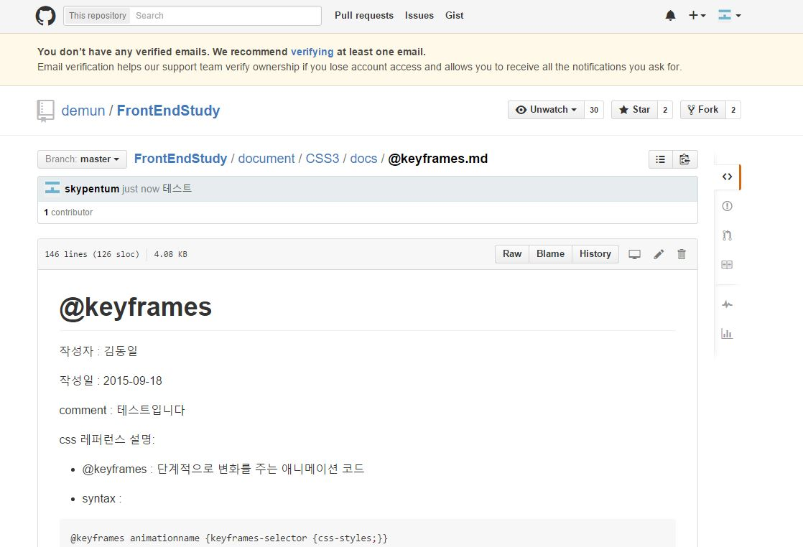

# Orion 

 - web broswer를 통해서 소스 코딩 및 문서 작업을 할 수 있는 Web Develop Tool
 
 - Open Source 인 Eclipse 에서 제공하며, 별도의 설치 없이 사용 가능
 	- 이클립스:  http://www.eclipse.org/ide/
 	- 오리온 :  https://orionhub.org/

 - 사용 시 login을 해야하는데 github 사이트와 연동 가능하여, github에 존재하는 repository를 이곳에서 edit가 가능함.

# Orion 특징(github 중심으로 설명)

 - github 연동 : 
   github 사이트의 repository를 동기화하여 이곳에서 edit 할 수 있다.

   사용 방법은 window 용 github Desktop과 유사하다.

 - 문서 작업(*.md)의 경우 edit 시 우측의 미리보기를 통해 사용자가 edit 한 내용을 그대로 output할 수 있음.

